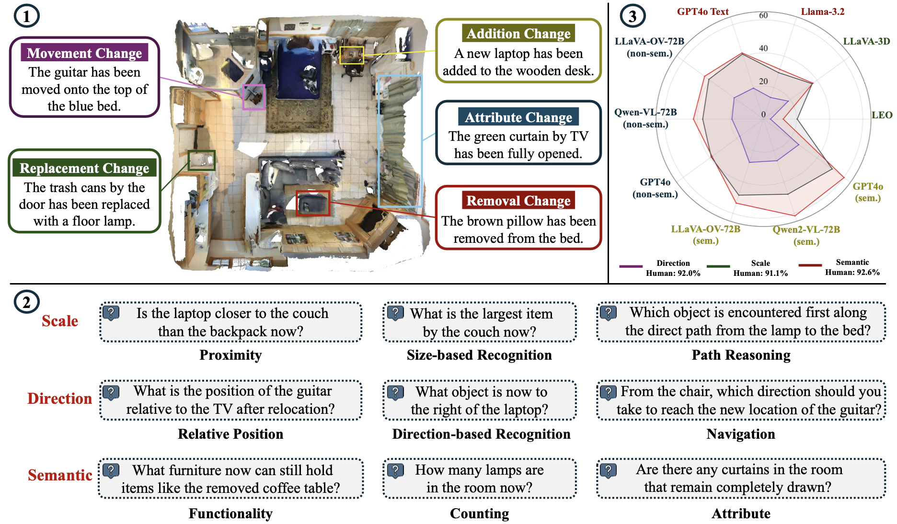

<h1 align='center' style="text-align:center; font-weight:bold; font-size:2.0em;letter-spacing:2.0px;">
                Hypo3D: Exploring Hypothetical Reasoning in 3D</h1>      
<p align='center' style="text-align:center;font-size:1.25em;">
    <a href="https://yebulabula.github.io/" target="_blank" style="text-decoration: none;">Ye Mao</a>,&nbsp;
    <a href="https://scholar.google.com/citations?user=2Y0-0C8AAAAJ&hl=en" target="_blank" style="text-decoration: none;">Weixun Luo</a>,&nbsp;
    <a href="https://tomtomtommi.github.io/" target="_blank" style="text-decoration: none;">Junpeng Jing</a>,&nbsp;
    <a target="_blank" style="text-decoration: none;">Anlan Qiu</a>,&nbsp;
    <a href="https://www.imperial.ac.uk/people/k.mikolajczyk"  target="_blank" style="text-decoration: none;">Krystian Mikolajczyk</a>,&nbsp;<br/>
&nbsp;Stanford University<br/>
<em>NeurIPS 2024 (D&B)</em><br/>
<a href="https://hourvideo.stanford.edu" title="Website" target="_blank" rel="nofollow" style="text-decoration: none;">🌎Website</a> |
<a href="https://huggingface.co/datasets/HourVideo/HourVideo" title="Dataset" target="_blank" rel="nofollow" style="text-decoration: none;">🤗 Dataset</a> |
<a href="https://arxiv.org/abs/2411.04998" title="aXiv" target="_blank" rel="nofollow" style="text-decoration: none;">📄 arXiv</a> |
<a href="https://huggingface.co/datasets/HourVideo/HourVideo/tree/main/socratic_models_captions" title="aXiv" target="_blank" rel="nofollow" style="text-decoration: none;">📖 Captions</a> |
<a href="https://eval.ai/web/challenges/challenge-page/2433/overview" title="EvalAI" target="_blank" rel="nofollow" style="text-decoration: none;">🥇 EvalAI</a>
</p>

# Hypo3D: Exploring Hypothetical Reasoning in 3D.

**[Imperial College London](https://www.imperial.ac.uk/)**

[[`Paper`](https://arxiv.org/abs/2502.00954)] [[`Project Website`](https://matchlab-imperial.github.io/Hypo3D/)]

[Ye Mao](https://yebulabula.github.io/), [Weixun Luo](https://scholar.google.com/citations?user=2Y0-0C8AAAAJ&hl=en), [Junpeng Jing](https://tomtomtommi.github.io/), Anlan Qiu, [Krystian Mikolajczyk](https://www.imperial.ac.uk/people/k.mikolajczyk)

[***News***] [04/02/2025] The Hypo3D paper is released on Arxiv. 🔥🔥🔥

Official implementation of [Hypo3D: Exploring Hypothetical Reasoning in 3D](https://arxiv.org/abs/2502.00954)



## Key Takeaways:
> * Hypo3D Task Definition: Given a past 3D scene (e.g., point cloud, top-view image, scene captions, etc) and a context change description, the task objective is to first imagine the current scene state after the change and answer the questions in the hypothetically changed scene.

> * The benchmark consists of 7,727 context changes and 14,885 question-answer pairs across 700 indoor scenes. These context changes span five categories: (1) Movement Change, involving geometric transformations like translation or rotation; (2) Removal Change, taking away objects; (3) Attribute Change, modifying object properties such as color and state; (4) Addition Change, introducing new objects; and (5) Replacement Change, substituting existing objects with new ones.

## About this code
The Hypo3D codebase is written in Python and provides simple modules for benchmarking 10 Foundation models, including LLM, 2D VLMs, and 3D VLMs. The core module structure is as follows:
```
Hypo3D/
├── LLM/                          # Storing scripts for LLM models that use scene captions as input for 3D scene processing.
│   ├── GPT4o-text.               # Folder for evaluating GPT4o in text-only mode.
│   ├── llama/                    # Folder for evaluating LLama3.2 3B.
├── 2D-VLM/                       # Storing scripts for 2D-VLM models that use top-view maps as input for 3D scene processing.
│   ├── Claude/                   # Folder for evaluating Claude 3.5 Sonnet.
│   ├── GPT4o/                    # Folder for evaluating GPT4o in vison-language mode.
│   ├── Qwen2-VL/                 # Folder for evaluating Qwen2-VL 7B and 72B.
│   ├── llava-ov/                 # Folder for evaluating LLaVA-OV 7B and 72B.
├── 3D-VLM/                       # Storing scripts for 2D-VLM models that use point cloud/multi-view images as input for 3D scene processing.
│   ├── LLaVA-3D/                 # Folder for evaluating LLaVA-3D model 7B.
│   └── LEO/ (coming soon)        # Folder for evaluating LEO model 7B.
├── exp/                          # Experiemental results for various models.
├── metric_compute.py             # Compute exact match/partial match for each context change category.
├── ...

```

### Download the Hypo3D Benchmark

1. Download 3D scene representations in Hypo3D dataset
   ```
   git clone https://huggingface.co/datasets/MatchLab/Hypo3D
   mv Hypo3D dataset # rename dataset folder
   cd dataset
   ```
2. [Download Hypo3D dataset in the dataset folder](https://drive.google.com/drive/folders/1ZD-xPBSrP-CldUeaEA3SIZh8BrpBecip)

3. ```
   cd ../3D-VLM/LLaVA-3D
   ```
   [Download embodiedscan_infos_full_updated.json file](https://drive.google.com/drive/folders/1ZD-xPBSrP-CldUeaEA3SIZh8BrpBecip) if you want to evaluate LLaVA-3D model.


## Citation

If you find our benchmark is helpful, please cite our paper:

```
@article{mao2025hypo3d,
  title={Hypo3D: Exploring Hypothetical Reasoning in 3D},
  author={Mao, Ye and Luo, Weixun and Jing, Junpeng and Qiu, Anlan and Mikolajczyk, Krystian},
  journal={arXiv preprint arXiv:2502.00954},
  year={2025}
}
